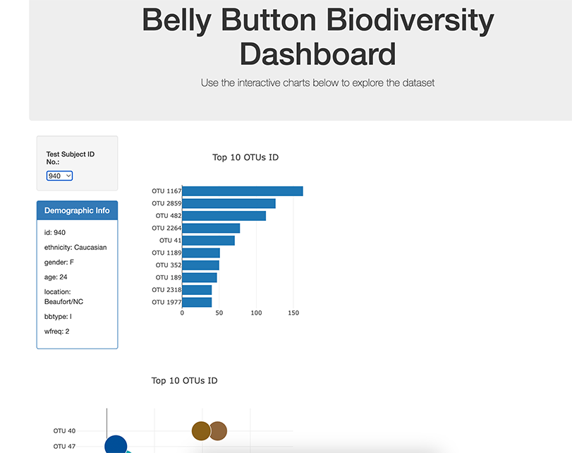

# belly-button-challenge
## Data Visualization with JavaScript
##### Eric Johnson
##### January 2024

Please visit the link below for a working copy of the challenge:
https://ericjjohnson2.github.io/belly-button-challenge/

This is my first Javascript code and the code was made in collaboration with my study group, Weinei, Mitchell, and Lucinda, as well with assistance instructor. I've used ChatGPT to help debug. 

The code reads a json file with microbes in human navels, allowing you to select from a dropdown choosing a subject and displaying two graphs with the top 10 operational taxonomic units (OTUs) using D3, Plotly, and Javascript. In addition to the two graphs, there is a panel displaying demographic information for each subject. Used Github Pages in the link above for a live version of this site. 

Additional references:
https://developer.mozilla.org/en-US/docs/Web/JavaScript/Reference/Global_Objects/Array/forEach 
https://robdunnlab.com/projects/belly-button-biodiversity/results-and-data/
https://www.youtube.com/watch?v=o5g-lUuFgpg
https://plotly.com/javascript/ 

